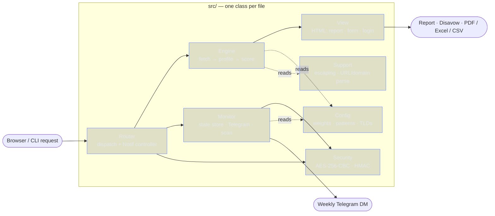
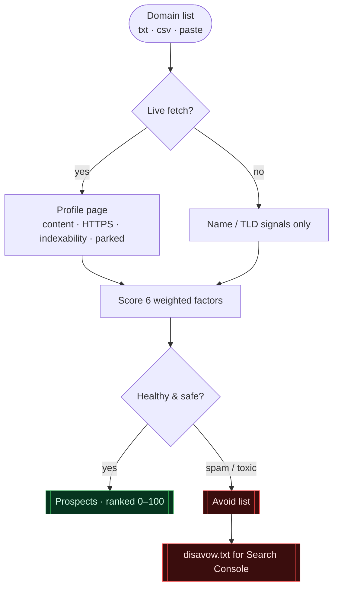
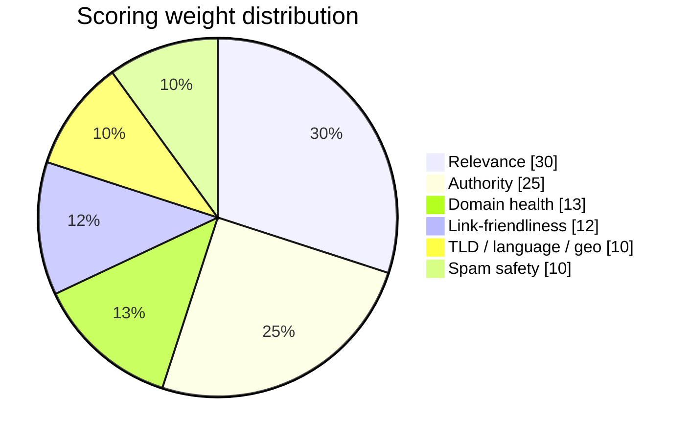
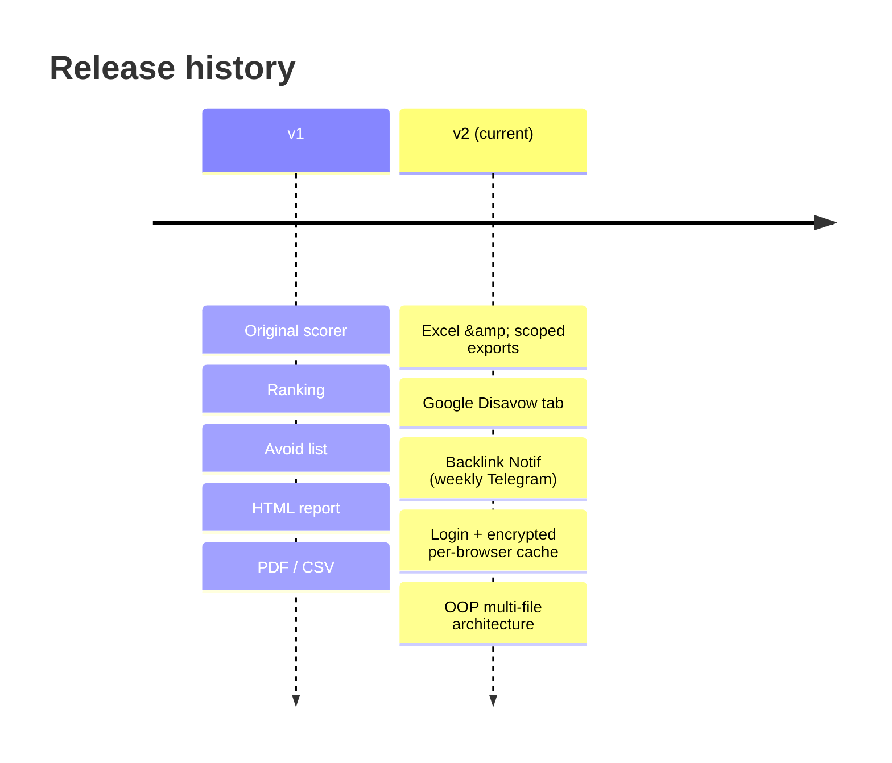

<!-- ANIMATED HEADER -->
<p align="center">
  
</p>

<!-- ANIMATED TYPING SUBTITLE -->
<p align="center">
  
</p>

<!-- BADGES -->
<p align="center">
  
  
  
  
  
  
</p>

<p align="center">
  <b>Score backlink prospects, audit existing links for spam / toxicity, generate a
  ready-to-upload Google Disavow file, and get weekly Telegram alerts.</b>
</p>

---

## Overview

You have a list of domains — either **candidates you want a link from**, or
**sources that already link to you**. This tool:

1. **Ranks** each domain 0–100 by how good a backlink from it would be for *your*
   site — relevance, authority, guest-post friendliness, domain health, TLD /
   language / geo fit, and spam-safety.
2. **Separates** the unusable ones (piracy / adult / gambling, dead, parked,
   de-indexed) into an **Avoid** list.
3. **Builds a Google Disavow file** from the spam / toxic domains, ready to upload
   to Search Console.
4. **Monitors** a saved list of your existing backlinks and **alerts you on
   Telegram** if any of them ever turns spam / toxic (weekly, via cron).

It ships in **two editions**:

| Edition | File | Use it when |
|---|---|---|
| **Web app** (PHP) | `index.php` + `src/` | You want a browser UI on cPanel / shared hosting — no command line. |
| **Terminal** (Python) | [`terminal-version/`](terminal-version/) | You prefer a CLI, automation, or running on a server / cron. |

---

## Architecture

The web app is a clean object-oriented design: `Router` dispatches, `Engine`
analyses, `View` renders, while `Security` and `Monitor` handle encryption and
the Telegram monitor. `index.php` only bootstraps the autoloader and config.



---

## Scoring pipeline

Every domain flows through the same pipeline. Live mode fetches and profiles the
page; offline mode scores from the name and TLD only.



### Weights at a glance



| Factor | Weight | Meaning |
|---|--:|---|
| Relevance | 30 | Topic match to your site (a relevant link is worth the most) |
| Authority | 25 | Domain strength (real DR if you provide it, else a content proxy) |
| Link-friendliness | 12 | Openly accepts guest posts → realistic to win |
| Domain health | 13 | Live, indexable, real content, not parked |
| TLD / language / geo | 10 | Reputable TLD, language fit |
| Spam safety | 10 | NOT a PBN / toxic neighborhood (a bad source can hurt you) |

Weights normalise over whatever signals are available. **Start outreach at the top
of the list, and prioritise rows tagged "guest post".**

> **Authority is approximate in live mode.** Without a paid API the tool proxies
> authority from content / HTTPS / indexing. For an accurate ranking, feed a CSV
> with a `dr` / domain-rating column (Ahrefs / Moz / Semrush) — it is used
> automatically.

---

## Features

- **Prospect scoring** — six weighted factors, transparent per-row "why" breakdown.
- **Avoid list** — toxic neighborhoods, dead / parked / de-indexed pages auto-excluded.
- **Google Disavow tab** — one click to download `disavow.txt` (`domain:` lines, with
  the matched signal as a comment). Conservative by design: only genuinely spam /
  toxic domains are listed — never healthy links.
- **Exports** — PDF, **Excel** (`.xls`), and CSV, scoped to *all results* or
  *guest-post-only*.
- **Backlink Notif** — paste your live backlinks + a Telegram bot token; get a weekly
  DM listing any newly spam / toxic domains. Runs for 1 year per start.
- **Login** — a username / password gate, asked **once per browser** then remembered
  ~1 year via a signed cookie.
- **Refresh-safe, encrypted cache** — big lists are analysed once; refreshing the
  results page re-serves an **encrypted, per-browser** cached report instead of
  re-running. A loading overlay with a live timer shows progress meanwhile.
- **Privacy first** — all at-rest data (monitor settings, cache) is **AES-256-CBC
  encrypted with HMAC authentication**; the Telegram token and chat id are stored only
  in that encrypted file and never rendered to the page (shown as dots).

---

## Quick start — Web app (cPanel / shared hosting)

1. In cPanel **File Manager**, upload the whole project into a folder under
   `public_html` (e.g. `public_html/backlink/`) so `index.php`, `config.php`, the
   `src/` folder and `.htaccess` are all there.
2. Open it in a browser: `https://yourdomain.com/backlink/`.
3. Sign in (default `admin` / `adminA` — **change these**, see Configuration).
4. Enter your site URL, paste candidate domains (one per line; optional
   `domain,DR,spam`) or upload a `.txt` / `.csv`, and click **Analyze & rank**.
5. Review the **Prospects** and **Google Disavow** tabs; export as PDF / Excel / CSV.

**Requirements:** PHP **7.4+** with the **cURL** and **OpenSSL** extensions (standard
on cPanel). `mbstring` is used if present but not required.

---

<details>
<summary><b>Configuration</b> — settings, secrets, and going-live checklist</summary>

<br>

Everything you need to change lives in **`config.php`** (root):

| Setting | Purpose | Default |
|---|---|---|
| `AUTH_USER` / `AUTH_PASS` | Login credentials (set both to `''` to disable) | `admin` / `adminA` |
| `ACCESS_PASSWORD` | Optional extra password on POST actions | `''` |
| `NOTIF_SECRET_KEY` | **At-rest encryption key — change to a long random string** | placeholder |
| `NOTIF_CRON_TOKEN` | Secret in the weekly cron URL — change to random | placeholder |
| `NOTIF_INTERVAL` | Weekly-check throttle | 7 days |
| `NOTIF_DURATION` | Monitor lifetime | 1 year |

> **Keep real secrets out of git:** create a `config.local.php` next to `config.php`
> with the same `define()` lines and your real values. It is loaded first and is
> **git-ignored**, so your secrets are never committed. The defaults in `config.php`
> only apply to whatever you have not already defined.

> **Change `admin` / `adminA` and `NOTIF_SECRET_KEY` before going live.**

</details>

<details>
<summary><b>Weekly Telegram monitor (cron)</b> — set up the automated audit</summary>

<br>

1. Open the **Backlink Notif** tab, paste your existing backlink domains, and your
   Telegram **bot token** (from [@BotFather](https://t.me/BotFather)) and **chat id**
   (from [@userinfobot](https://t.me/userinfobot)). Message your bot once so it can DM
   you. Submit — you will get a "Backlink Checker started" confirmation.
2. In cPanel, go to **Cron Jobs** and add one weekly job (replace host + token):

   ```cron
   0 9 * * 1 curl -fsS "https://YOURDOMAIN/backlink/index.php?cron=run&token=PUT-YOUR-CRON-TOKEN-HERE" >/dev/null 2>&1
   ```

   The endpoint **self-throttles to once / 7 days**, so triggering it more often is
   harmless. It alerts you only about **newly** spam / toxic domains.

</details>

<details>
<summary><b>Security model</b> — how data is protected at rest and in transit</summary>

<br>

- The web app **fetches arbitrary URLs server-side**. If the host is public, keep the
  login enabled and / or add cPanel **Directory Privacy**.
- `config.php`, `config.local.php`, and the entire `src/` directory are blocked from
  direct web access via `.htaccess` (defense in depth).
- The `notif_data/` directory (encrypted monitor state + per-browser cache) is
  auto-created with a deny-all `.htaccess` and is **git-ignored**.
- Encryption: **AES-256-CBC**, **encrypt-then-HMAC** (tamper-evident), with independent
  derived keys. The login cookie is HMAC-signed.
- The browser is told **`no-store`**; refresh-safe results come from the server-side
  encrypted cache, not the browser cache.

</details>

---

## Project structure

```
.
├── index.php            # Thin bootstrap (web root entry point)
├── config.php           # Your editable settings / secrets
├── .htaccess            # noindex headers + blocks config / src from the web
├── robots.txt
├── src/                 # Object-oriented application (one class per file)
│   ├── Config.php       #   algorithmic defaults (weights, patterns, TLD tables)
│   ├── Support.php      #   helpers: escaping, URL / domain parsing, data dir
│   ├── Engine.php       #   the scoring pipeline (fetch → profile → score)
│   ├── Security.php     #   AES encryption, login cookie, per-browser cache
│   ├── Monitor.php      #   Backlink Notif: state store + Telegram + scan
│   ├── View.php         #   all HTML (report, form, notif page, login)
│   └── Router.php       #   request dispatch + the Notif controller
└── terminal-version/    # Python CLI edition (see its own README)
    └── backlink_evaluator.py
```

---

## Terminal version (Python CLI)

A dependency-free (standard-library) scorer that produces the same ranked HTML report
plus a ranked CSV. See [`terminal-version/README.md`](terminal-version/README.md).

```bash
cd terminal-version

# Rank a list for your site (HTML report + CSV)
python backlink_evaluator.py --input backlinks.txt --target-url "https://your-site.com"

# Custom outputs, extra niche keywords, more workers
python backlink_evaluator.py -i backlinks.txt -o report.html --csv-out out.csv --niche "fintech, saas" --workers 16

# Skip live fetching (offline — name / TLD scoring only)
python backlink_evaluator.py -i backlinks.txt --no-fetch
```

<details>
<summary><b>All CLI flags</b></summary>

<br>

| Flag | Default | Meaning |
|---|---|---|
| `--input, -i` | `backlinks.txt` | Candidate domains (.txt / .csv / .json) |
| `--output, -o` | `backlink_report.html` | Ranked HTML report |
| `--csv-out` | `prospects.csv` | Ranked prospects CSV |
| `--target-url` | your site | Your website (defines relevance) |
| `--niche` | *(generic seed)* | Extra niche keywords |
| `--workers` | `12` | Concurrent fetch workers |
| `--no-fetch` / `--no-verify-ssl` / `--limit N` | off / off / 0 | Offline mode / no SSL check / cap entries |

</details>

> The **Excel & Google-Disavow exports and the weekly Telegram monitor** are currently
> **web-app features** (the For Removal / Disavow and Backlink Notif tabs). Porting them
> to the CLI is planned.

---

## Versions



- **v1** — the original scorer: ranking, Avoid list, HTML report, PDF / CSV.
- **v2 (current)** — adds Excel & scoped exports, Google Disavow tab, Backlink Notif
  (weekly Telegram alerts), login, encrypted per-browser cache & loading timer, and the
  object-oriented multi-file architecture.

See [Releases](../../releases) for downloadable packages.

---

## License

MIT — see [`LICENSE`](LICENSE). Use it freely; no warranty. Disavowing healthy links
can hurt your rankings — always review the generated disavow file before uploading.

<p align="center">
  
</p>
